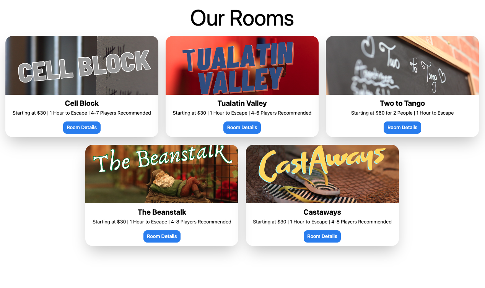
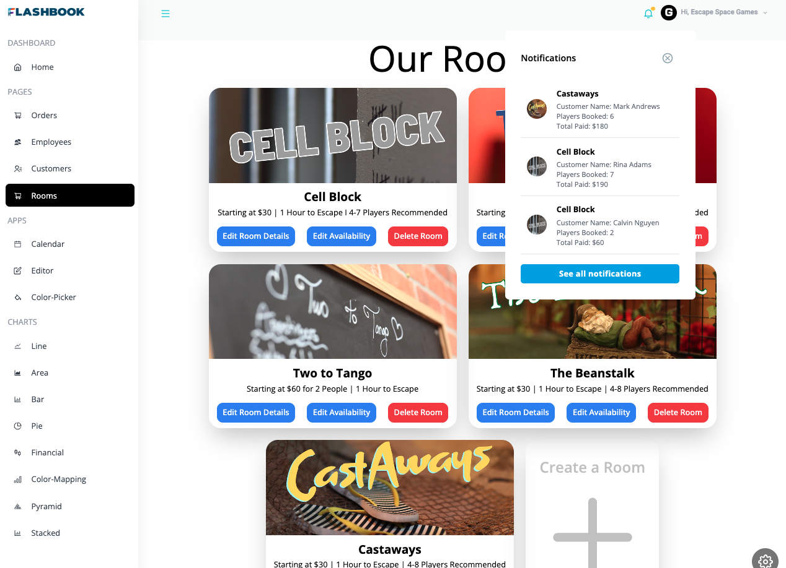

  

# Flashbook

An all-in-one Escape Room management tool with scheduling and booking services.

- **Purpose of the App:**

  Flashbook was created for a client who needed a service that would allow them to manage an escape room business. The client needed to be able to create and set the room details, set the availability schedule for each room, give customers the ability to view available timeslots, and allow customers to select a timeslot and purchase tickets. The admin dashboard allows the client to view orders as well as customer information. Payments are handled by Stripe.

- **Features of the App:**
  - Protected login that allows the escape room owner to view admin dashboard and manage multiple rooms and view details about orders and customers
  - Admin can create a room and timeslots which are displayed to the customer on a calendar
  - Customers can select a room to view additional details and select a date to view available timeslots for that room
  - Once customers select a timeslot, they are taken through a checkout process provided by Stripe

## Live Links:

- Admin View: https://flashbook-bookings.netlify.app/
- Customer View: https://flashbk.netlify.app/

## Site Preview:

  

  

## Introduction video of the project:

COMING SOON

## Featured Technologies:

React, Redux, Tailwind, Syncfusion, Node.js, Express, MongoDB, Mongoose, Stripe, Socket.io

## Creators:

[David Chen](https://github.com/DCXan) | [Rina Mendoza](https://github.com/mendo94) | [Calvin Nguyen](https://github.com/cnguyen2133)
